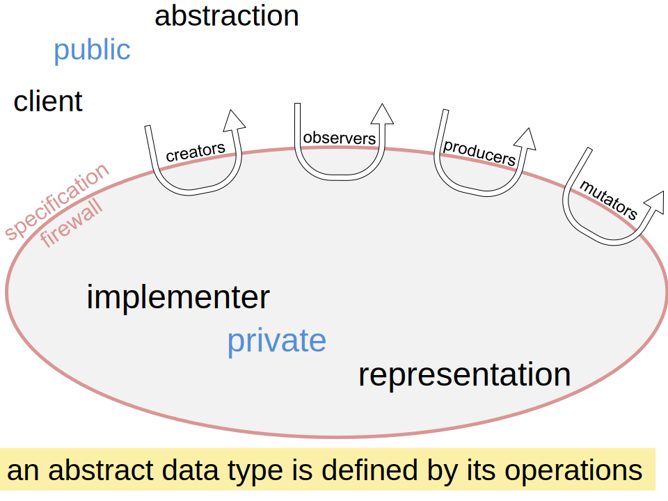

# Reading 10: Abstract Data Types

## What abstraction means

Abstract data types are an instance of a general principle in software engineering, which goes by many names with slightly different shades of meaning. Here are some of the names that are used for this idea:

* **Abstraction**. Omitting or hiding low-level details with a simpler, higher-level idea.

* **Modularity**. Dividing a system into components or modules, each of which can be designed, implemented, tested, reasoned about, and reused separately from the rest of the system.

* **Encapsulation**. Building a wall around a module so that the module is responsible for its own internal behavior, and bugs in other parts of the system can’t damage its integrity.

* **Information hiding**. Hiding details of a module’s implementation from the rest of the system, so that those details can be changed later without changing the rest of the system.

* **Separation of concerns**. Making a feature (or “concern”) the responsibility of a single module, rather than spreading it across multiple modules.

### User-defined types

In Java, as in many modern programming languages, the separation between built-in types and user-defined types is a bit blurry. The classes in `java.lang`, such as `Integer` and `Boolean`, are built-in in the sense that the Java language specification requires them to exist and behave in a certain way, but they are defined using the same class/object abstraction as user-defined types. But Java complicates the issue by having primitive types that are not objects. The set of these types, such as `int` and `boolean`, cannot be extended by the user.


## An abstract type is defined by its operations



The essential idea here is that **an abstract data type is defined by its operations**. The set of operations for a type T, along with their specifications, fully characterize what we mean by T.

So, for example, when we talk about the `List` type, what we mean is not a linked list or an array or any other specific data structure for representing a list.

Instead, the `List` type is a set of opaque values — the possible objects that can have `List` type — that satisfy the specifications of all the operations of `List: get()`, `size()`, etc. The values of an abstract type are opaque in the sense that a client can’t examine the data stored inside them, except as permitted by operations.


## Testing an abstract data type

```java
// testing strategy for each operation of MyString:
//
// valueOf():
//    partiton on return value: true, false
// length(), charAt(), substring():
//    partition on string length: 0, 1, >1
//    partition on this: produced by valueOf(), produced by substring()
// charAt(): 
//    partition on i=0, 0<i<len-1, i=len-1
// substring():
//    partition on start=0, 0<start<len, start=len
//    partition on end=0, 0<end<len, end=len
//    partition on end-start: 0, >0
```

Now we want test cases that cover these partitions. Note that writing test cases that use `assertEquals` directly on `MyString` objects wouldn’t work, because we don’t have an equality operation defined on `MyString`. We’ll talk about how to implement equality carefully in a later reading. For now, the only operations we can perform with MyStrings are the ones we’ve defined above: `valueOf`, `length`, `charAt`, and `substring`.

Given that constraint, a compact test suite that covers all these partitions might look like:

```java
@Test public void testValueOfTrue() {
    MyString s = MyString.valueOf(true);
    assertEquals(4, s.length());
    assertEquals('t', s.charAt(0));
    assertEquals('r', s.charAt(1));
    assertEquals('u', s.charAt(2));
    assertEquals('e', s.charAt(3));
}

@Test public void testValueOfFalse() {
    MyString s = MyString.valueOf(false);
    assertEquals(5, s.length());
    assertEquals('f', s.charAt(0));
    assertEquals('a', s.charAt(1));
    assertEquals('l', s.charAt(2));
    assertEquals('s', s.charAt(3));
    assertEquals('e', s.charAt(4));
}

@Test public void testEndSubstring() {
    MyString s = MyString.valueOf(true).substring(2, 4);
    assertEquals(2, s.length());
    assertEquals('u', s.charAt(0));
    assertEquals('e', s.charAt(1));
}

@Test public void testMiddleSubstring() {
    MyString s = MyString.valueOf(false).substring(1, 2);
    assertEquals(1, s.length());
    assertEquals('a', s.charAt(0));
}

@Test public void testSubstringIsWholeString() {
    MyString s = MyString.valueOf(false).substring(0, 5);
    assertEquals(5, s.length());
    assertEquals('f', s.charAt(0));
    assertEquals('a', s.charAt(1));
    assertEquals('l', s.charAt(2));
    assertEquals('s', s.charAt(3));
    assertEquals('e', s.charAt(4));
}

@Test public void testSubstringOfEmptySubstring() {
    MyString s = MyString.valueOf(false).substring(1, 1).substring(0, 0);
    assertEquals(0, s.length());
}
```

Try to match each test case to the subdomains it covers.
