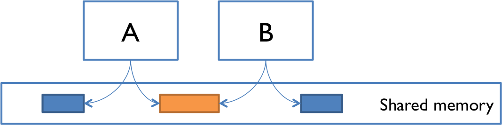

# Reading 20: Concurrency

## Concurrency

*Concurrency* means multiple computations are happening at the same time. Concurrency is everywhere in modern programming, whether we like it or not:

* Multiple computers in a network
* Multiple applications running on one computer
* Multiple processors in a computer (today, often multiple processor cores on a single chip)

In fact, concurrency is essential in modern programming:

* Web sites must handle multiple simultaneous users.
* Mobile apps need to do some of their processing on servers (“in the cloud”).
* Graphical user interfaces almost always require background work that does not interrupt the user. For example, Eclipse compiles your Java code while you’re still editing it.

Being able to program with concurrency will still be important in the future. Processor clock speeds are no longer increasing. Instead, we’re getting more cores with each new generation of chips. So in the future, in order to get a computation to run faster, we’ll have to split up a computation into concurrent pieces.


## Two models for concurrent programming

There are two common models for concurrent programming: shared memory and message passing.

### **Shared memory**



In the shared memory model of concurrency, concurrent modules interact by reading and writing shared objects in memory. In the figure at right, A and B are concurrent modules, with access to the same shared memory space. The blue objects are private to A or B (only one module can access it), but the orange object is shared by both A and B (both modules have a reference to it).

Examples of the shared-memory model:

* A and B might be two processors (or processor cores) in the same computer, sharing the same physical memory.

* A and B might be two programs running on the same computer, sharing a common filesystem with files they can read and write.

* A and B might be two threads in the same Java program (we’ll explain what a thread is below), sharing the same Java objects.

### **Message passing**


In the message-passing model, concurrent modules interact by sending messages to each other through a communication channel. Modules send off messages, and incoming messages to each module are queued up for handling. Examples include:

* A and B might be two computers in a network, communicating by network connections.

* A and B might be a web browser and a web server – A opens a connection to B and asks for a web page, and B sends the web page data back to A.

* A and B might be an instant messaging client and server.

* A and B might be two programs running on the same computer whose input and output have been connected by a pipe, like ls | grep typed into a command prompt.


## Processes, threads, time-slicing

The message-passing and shared-memory models are about how concurrent modules communicate. The concurrent modules themselves come in two different kinds: processes and threads.

### Process

A process is an instance of a running program that is *isolated* from other processes on the same machine. In particular, it has its own private section of the machine’s memory.

The process abstraction is a *virtual computer*. It makes the program feel like it has the entire machine to itself – like a fresh computer has been created, with fresh memory, just to run that program.

Just like computers connected across a network, processes normally share no memory between them. A process can’t access another process’s memory or objects at all. Sharing memory between processes is possible on most operating systems, but it needs special effort. By contrast, a new process is automatically ready for message passing, because it is created with standard input & output streams, which are the `System.out` and `System.in` streams you’ve used in Java.

Whenever you start a Java program – indeed, whenever you start any program on your computer – it starts a fresh process to contain the running program.

### Thread

A thread is a locus of control inside a running program. Think of it as a place in the program that is being run, plus the stack of method calls that led to that place (so the thread can go back up the stack when it reaches `return` statements).

Just as a process represents a virtual computer, the thread abstraction represents a virtual processor. Making a new thread simulates making a fresh processor inside the virtual computer represented by the process. This new virtual processor runs the same program and shares the same memory as other threads in the process.

Threads are automatically ready for shared memory, because threads share all the memory in the process. It takes special effort to get “thread-local” memory that’s private to a single thread. It’s also necessary to set up message-passing explicitly, by creating and using queue data structures. We’ll talk about how to do that in a future reading.

Whenever you run a Java program, the program starts with one thread, which calls `main()` as its first step. This thread is referred to as the main thread.

### Time slicing


How can you have many concurrent threads with only one or two processors in your computer? When there are more threads than processors, concurrency is simulated by **time slicing**, which means that the processor switches between threads. The figure on the right shows how three threads T1, T2, and T3 might be time-sliced on a machine that has only two actual processors. In the figure, time proceeds downward, so at first one processor is running thread T1 and the other is running thread T2, and then the second processor switches to run thread T3. Thread T2 simply pauses, until its next time slice on the same processor or another processor. The far right part of the figure shows how this looks from each thread’s point of view. Sometimes a thread is actively running on a processor, and sometimes it is suspended waiting for its next chance to run on some processor.

On most systems, time slicing happens unpredictably and nondeterministically, meaning that a thread may be paused or resumed at any time.


## Starting a thread in Java

You can start new threads by making an instance of Thread and telling it to `start()`. You provide code for the new thread to run by creating a class implementing `Runnable`. The first thing the new thread will do is call the `run()` method in this class. For example:

```java
// ... in the main method:
new Thread(new HelloRunnable()).start();

// elsewhere in the code
public class HelloRunnable implements Runnable {
    public void run() {
        System.out.println("Hello from a thread!");
    }
}
```

But a very common idiom is starting a thread with an anonymous Runnable, which eliminates the need to name the HelloRunnable class at all:

```java
new Thread(new Runnable() {
    public void run() {
        System.out.println("Hello from a thread!");
    }
}).start();
```

The next two sections discuss the idea of anonymous classes, because they’re widely used in Java beyond just threads.


## Anonymous classes

An anonymous class declares an unnamed class that implements an interface and immediately creates the one and only instance of that class. Compare to the code above:

```java
// no StringLengthComparator class!
SortedSet<String> strings = new TreeSet<>(new Comparator<String>() {
    @Override public int compare(String s1, String s2) {
        if (s1.length() == s2.length()) {
            return s1.compareTo(s2);
        }
        return s1.length() - s2.length();
    }
});
strings.addAll(List.of("yolanda", "zach", "alice", "bob"));
// strings is { "bob", "zach", "alice", "yolanda" }
```

Advantages of anonymous class over named class:

* If we’re only using the comparator in this one piece of code, we’ve reduced its scope by using an anonymous class. With a named class, any other code could start using and depending on `StringLengthComparator`.

* A reader no longer has to search elsewhere for the details of the comparator. Everything is right here.

Disadvantages:

* If we need the same comparator more than once, we might be tempted to copy-and-paste the anonymous class. A named class is more DRY.

* If the implementation of the anonymous class is long, it interrupts the surrounding code, making it harder to understand. A named class is separated out as a modular piece.

So anonymous classes are good for short one-off implementations of a method.


## Using an anonymous Runnable to start a thread

The `Runnables` we use to create new threads are almost always short, one-off implementations, so they are ideal candidates for anonymous classes.

Here’s the example we used above:

```java
new Thread(new Runnable() {
    public void run() {
        System.out.println("Hello from a thread!");
    }
}).start();
```

Rather than (1) declare a class that implements `Runnable` where the `run` method calls `System.out.println`, (2) create an instance of that class, and (3) pass that instance to the Thread constructor, we do all three steps in one go with an anonymous `Runnable`.

If you’re feeling clever, you can go one step further with Java’s lambda expressions:

```java
new Thread(() -> System.out.println("Hello from a thread!")).start();
```

Whether that’s more or less easy to understand is up for debate. `Runnable` and `run` never appear at all, so you certainly have to do more research to understand this construction the first time you come across it.


## Reordering

The problem is that modern compilers and processors do a lot of things to make the code fast. One of those things is making temporary copies of variables like `answer` and `ready` in faster storage (processor registers, or processor caches), and working with them temporarily before eventually storing them back to their official location in memory. The storeback may occur in a different order than the variables were manipulated in your code. Here’s what might be going on under the covers (but expressed in Java syntax to make it clear). The processor is effectively creating two temporary variables, `tmpr` and `tmpa`, to manipulate the fields `ready` and `answer`:

```java
private void computeAnswer() {
    // ... calculate for a long time ...

    boolean tmpr = ready;
    int tmpa = answer;

    tmpa = 42;
    tmpr = true;

    ready = tmpr;
                   // <-- what happens if useAnswer() interleaves here?
                   // ready is set, but answer isn't.
    answer = tmpa;
}
```


## Concurrency is hard to test and debug

Concurrency bugs exhibit very poor reproducibility. It’s hard to make them happen the same way twice. Interleaving of instructions or messages depends on the relative timing of events that are strongly influenced by the environment. Delays can be caused by other running programs, other network traffic, operating system scheduling decisions, variations in processor clock speed, etc. Each time you run a program containing a race condition, you may get different behavior.

These kinds of bugs are *heisenbugs*, which are nondeterministic and hard to reproduce, as opposed to a *bohrbug*, which shows up repeatedly whenever you look at it. Almost all bugs in sequential programming are *bohrbugs*.

A heisenbug may even disappear when you try to look at it with println or a debugger! The reason is that printing and debugging are so much slower than other operations, often 100-1000x slower, that they dramatically change the timing of operations, and the interleaving.
