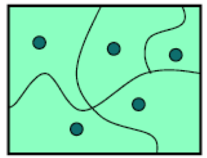
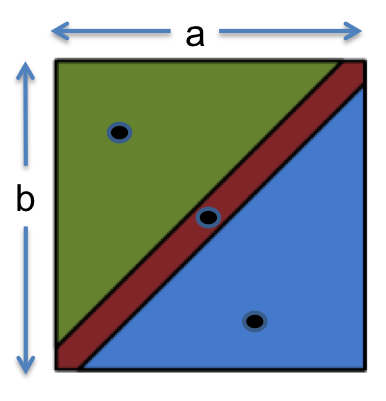
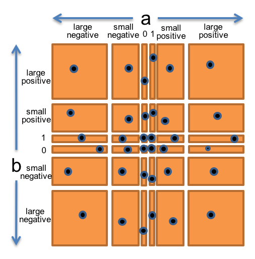

# Reading 3: Testing

## Choosing test cases by partitioning

* We want to pick a set of test cases that is small enough to be easy to write and maintain and quick to run, yet thorough enough to find bugs in the program.

* To do this, we divide the input space into ``subdomains``, each consisting of a set of inputs. Taken together, the subdomains from a ``partition``: a collection of disjoint sets that completely covers the input space, so that **every input lies in exactly one subdomain**. Then we choose one test case from each subdomain, and that's our test suite.

  

* The idea behind subdomains is to divide the input space into sets of similar inputs on which the program has similar behavior. Then we use one representative of each set. This approach makes the best use of limited testing resources by choosing dissimilar test cases, and forcing the testing to explore areas of the input space that random testing might not reach.

* ### Example: ``max()``

    Now let’s look at another example from the Java library: the integer max() function, also found in Math.

    ```java
    /**
    * ...
    * @param a  an argument
    * @param b  another argument
    * @return the larger of a and b.
    */
    public static int max(int a, int b)
    ```

    Mathematically, this method is a function of two arguments:

    ``max : int × int → int``

    Expressed compactly, the partition looks like this:

    ```java
    // partition: a < b; a > b; a = b
    ```

    Our test suite might then be:
    
    * (a,b) = (1, 2) to cover a < b

    * (a,b) = (10, -8) to cover a > b

    * (a,b) = (9, 9) to cover a = b

    


## Include boundaries in the partition

* Bugs often occur at boundaries between subdomains. Some examples:

    * 0 is a boundary between positive numbers and negative numbers

    * the maximum and minimum values of numeric types, like ``int`` or ``double``

    * emptiness for collection types, like the empty string, empty list, or empty set

    * the first and last element of a sequence, like a string or list

* Another is that boundaries may be places of discontinuity in the code’s behavior. When an ``int`` variable grows beyond its maximum positive value, for example, it abruptly becomes a negative number.

    It turns out that the ``abs()`` function in Java behaves in a very unexpected way on one of these boundaries, which the spec describes as follows:

    ```java
    /**
    * ...
    * Note that if the argument is equal to the value of Integer.MIN_VALUE, 
    * the most negative representable int value, the result is that same value, 
    * which is negative.
    * ...
    */
    ```

    For ``abs``, we would add subdomains for each of the relevant boundaries:

    * a = 0, because ``abs`` behaves differently on positive and negative numbers

    * a = ``Integer.MIN_VALUE``, the most negative possible ``int`` value, because the spec calls out some unusual behavior there

    * a = ``Integer.MAX_VALUE``, the largest positive ``int`` value, for symmetry and completeness

    Our test suite might then be:

    * a = 0
    * a = ``Integer.MIN_VALUE``
    * a = ``Integer.MAX_VALUE``
    * a = 17 to cover the subdomain ``0 < a < Integer.MAX_VALUE``
    * a = -3 to cover the subdomain ``Integer.MIN_VALUE < a < 0``

* ### Example: BigInteger.multiply()

    So we should think of ``multiply`` as a function taking two inputs, each of type ``BigInteger``, and producing one output of type ``BigInteger``:

    ``multiply : BigInteger × BigInteger → BigInteger``

    Let’s bring all these observations together into a single partition of the whole (a,b) space. We’ll choose a and b independently from:

    * 0
    * 1
    * small positive integer (≤ ``Long.MAX_VALUE`` and > 1)
    * small negative integer (≥ ``Long.MIN_VALUE`` and < 0)
    * large positive integer (> ``Long.MAX_VALUE``)
    * large negative integer (< ``Long.MIN_VALUE``)

    So this would produce $6 × 6 = 36$ subdomains that partition the space of pairs of integers. To produce the test suite from this partition, we would pick an arbitrary pair $(a,b)$ from each square of the grid, for example:

    * (a,b) = (0, 0) to cover (0, 0)
    * (a,b) = (0, 1) to cover (0, 1)
    * (a,b) = (0, 8392) to cover (0, small positive integer)
    * (a,b) = (0, -7) to cover (0, small negative integer)
    * …
    * (a,b) = ($-10^{60}$, $-10^{810}$) to cover (large negative, large negative)

    


## Automated unit testing with JUnit

* A JUnit unit test is written as a method preceded by the annotation ``@Test``. A unit test method typically contains one or more calls to the module being tested, and then checks the results using assertion methods like ``assertEquals``, ``assertTrue``, and ``assertFalse``.

* Note that the order of the parameters to ``assertEquals`` is important. The first parameter should be the expected result, **usually a constant**, that the test wants to see. The second parameter is the actual result, what the code actually does.


## Documenting your testing strategy

* It’s a good idea to write down the testing strategy you used to create a test suite: the partitions, their subdomains, and which subdomains each test case was chosen to cover. Writing down the strategy makes the thoroughness of your test suite much more visible to the reader.

* Document the partitions and subdomains in a comment at the top of the JUnit test class. For example, here’s a strategy for ``multiply``, using seven partitions:

    ```java
    public class Multiply {
    /*
    * Testing strategy
    *
    * cover the cartesian product of these partitions:
    *   partition on a: positive, negative, 0
    *   partition on b: positive, negative, 0
    *   partition on a: 1, !=1
    *   partition on b: 1, !=1
    *   partition on a: small (fits in a long value), or large (doesn't fit)
    *   partition on b: small, large
    * 
    * cover the subdomains of these partitions:
    *   partition on signs of a and b:
    *      both positive
    *      both negative
    *      different signs
    *      one or both are 0
    */
    ```

    Then every test case has a comment identifying the subdomains that it was chosen to cover, e.g.:

    ```java
    // covers a is positive, b is negative, 
    //        a fits in long value, b fits in long value,
    //        a and b have different signs
    @Test
    public void testDifferentSigns() {
        assertEquals(BigInteger.valueOf(-146), BigInteger.valueOf(73).multiply(BigInteger.valueOf(-2)));
    }

    // covers a = 1, b != 1, a and b have same sign
    @Test
    public void testIdentity() {
        assertEquals(BigInteger.valueOf(33), BigInteger.valueOf(1).multiply(BigInteger.valueOf(33)));
    }
    ```


## Black box and glass box testing

* ``Black box testing`` means choosing test cases only from the specification, not the implementation of the function. That’s what we’ve been doing in our examples so far. We partitioned and looked for boundaries in abs, max, and multiply without looking at the actual code for these functions. In fact, following the test-first programming approach, we hadn’t even written the code for these functions yet.

* ``Glass box testing`` means choosing test cases with knowledge of how the function is actually implemented. For example, if the implementation selects different algorithms depending on the input, then you should partition around the points where different algorithms are chosen. If the implementation keeps an internal cache that remembers the answers to previous inputs, then you should test repeated inputs.

    When doing glass box testing, you must take care that **your test cases don’t require specific implementation behavior that isn’t specifically called for by the spec**. For example, if the spec says “throws an exception if the input is poorly formatted,” then your test shouldn’t check specifically for a NullPointerException just because that’s what the current implementation does. **The specification in this case allows any exception to be thrown, so your test case should likewise be general in order to be correct, and preserve the implementor’s freedom**. 


## Coverage

* One way to judge a test suite is to ask how thoroughly it exercises the program. This notion is called coverage. Here are three common kinds of coverage:

    * **Statement coverage**: is every statement run by some test case?
    * **Branch coverage**: for every if or while statement in the program, are both the true and the false direction taken by some test case?
    * **Path coverage**: is every possible combination of branches — every path through the program — taken by some test case?

        ``Path coverage > Branch coverage > statement coverage``

* A standard approach to testing is to add tests until the test suite achieves adequate statement coverage: i.e., so that every reachable statement in the program is executed by at least one test case.

* In practice, statement coverage is usually measured by a code coverage tool, which counts the number of times each statement is run by your test suite. With such a tool, glass box testing is easy; you just measure the coverage of your black box tests, and add more test cases until all important statements are logged as executed.


## Unit and integration testing

* We’ve so far been talking about ``unit tests`` that test a single module in isolation. Testing modules in isolation leads to much easier debugging. When a unit test for a module fails, you can be more confident that the bug is found in that module, rather than anywhere in the program.

* In contrast to a unit test, an ``integration test`` tests a combination of modules, or even the entire program. If all you have are integration tests, then when a test fails, you have to hunt for the bug. It might be anywhere in the program. Integration tests are still important, because a program can **fail at the connections between modules**.

* Suppose you’re building a document search engine. Two of your modules might be ``load()``, which loads a file, and ``extract()``, which splits a document into its component words:

    ```java
    /** 
    * @return the contents of the file
    */
    public static String load(File file) { ... }

    /** 
    * @return the words in string s, in the order they appear, 
    *         where a word is a contiguous sequence of 
    *         non-whitespace and non-punctuation characters 
    */
    public static List<String> extract(String s) { ... }
    ```

    These methods might be used by another module index() to make the search engine’s index:

    ```java
    /**
    * @return an index mapping a word to the set of files
    *         containing that word, for all files in the input set 
    */
    public static Map<String, Set<File>> index(Set<File> files) { 
        ...
        for (File file : files) {
            String doc = load(file);
            List<String> words = extract(doc);
            ...
        }
        ...
    } 
    ```

    In our test suite, we would want:

    * unit tests just for ``load`` that test it on various files
    * unit tests just for ``extract`` that test it on various strings
    * unit tests for ``index`` that test it on various sets of files

    One mistake that programmers sometimes make is writing test cases for ``extract`` in such a way that the test cases depend on ``load`` to be correct. For example, a test case might use ``load`` to load a file, and then pass its result as input to ``extract``. But this is not a unit test of ``extract``. If the test case fails, then we don’t know if the failure is due to a bug in ``load`` or ``extract``.

    It’s better to think about and test ``extract`` in isolation. Using test partitions that involve realistic file content might be reasonable, because that’s how ``extract`` is actually used in the program. But don’t actually call ``load`` from the test case, because ``load`` may be buggy! **Instead**, store file content as a literal string, and pass it directly to ``extract``. That way you’re writing an isolated unit test, and if it fails, you can be more confident that the bug is in the module it’s actually testing.

    Note that the unit tests for ``index`` can’t easily be isolated in this way. When a test case calls ``index``, it is testing the correctness of not only the code inside ``index``, but also all the methods called by index. If the test fails, the bug might be in any of those methods. That’s why we want separate tests for ``load`` and ``extract``, to increase our confidence in those modules individually and localize the problem to the ``index`` code that connects them together.

    Isolating a higher-level module like ``index`` is possible if we write **stub** versions of the modules that it calls. For example, a stub for ``load`` wouldn’t access the filesystem at all, but instead would return mock ``file`` content no matter what File was passed to it. A stub for a class is often called a mock object. 


## Automated regression testing

* The code that runs tests on a module is a test driver (also known as a test harness or test runner). A test driver **should not** be an interactive program that prompts you for inputs and prints out results for you to manually check. Instead, a test driver should invoke the module itself on fixed test cases and automatically check that the results are correct. The result of the test driver should be either “all tests OK” or “these tests failed: …” A good testing framework, like JUnit, allows you to build and run this kind of test driver, with a suite of automated tests.

* Once you have test automation, it’s very important to rerun your tests when you modify your code. Software engineers know from painful experience that any change to a large or complex program is dangerous. Whether you’re fixing another bug, adding a new feature, or optimizing the code to make it faster, an automated test suite that preserves a baseline of correct behavior – even if it’s only a few tests – will save your bacon. Running the tests frequently while you’re changing the code prevents your program from regressing — introducing other bugs when you fix new bugs or add new features. Running all your tests after every change is called ``regression testing``.

* Whenever you find and fix a bug, take the input that elicited the bug and add it to your automated test suite as a test case. This kind of test case is called a regression test. This helps to populate your test suite with good test cases. Remember that a test is good if it elicits a bug — and every regression test did in one version of your code! Saving regression tests also protects against reversions that reintroduce the bug. The bug may be an easy error to make, since it happened once already.

* This idea also leads to test-first debugging. When a bug arises, immediately write a test case for it that elicits it, and immediately add it to your test suite. Once you find and fix the bug, all your test cases will be passing, and you’ll be done with debugging and have a regression test for that bug.


## Iterative test-first programming

* Effective software engineering does not follow a linear process. Practice ``iterative`` test-first programming, in which you are prepared to go back and revise your work in previous steps:

    1. Write a specification for the function.
    2. Write tests that exercise the spec. As you find problems, iterate on the spec and the tests.
    3. Write an implementation. As you find problems, iterate on the spec, the tests, and the implementation.

* Each step helps to validate the previous steps. Writing tests is a good way to understand the specification. The specification can be incorrect, incomplete, ambiguous, or missing corner cases. Trying to write tests can uncover these problems early, before you’ve wasted time working on an implementation of a buggy spec. Similarly, writing the implementation may help you discover missing or incorrect tests, or prompt you to revisit and revise the specification.

* Since it may be necessary to iterate on previous steps, it doesn’t make sense to devote enormous amounts of time making one step perfect before moving on to the next step. Plan for iteration:

    * For a large specification, start by writing only one part of the spec, proceed to test and implement that part, then iterate with a more complete spec.

    * For a complex test suite, start by choosing a few important partitions, and create a small test suite for them. Proceed with a simple implementation that passes those tests, and then iterate on the test suite with more partitions.

    * For a tricky implementation, first write a simple brute-force implementation that tests your spec and validates your test suite. Then move on to the harder implementation with confidence that your spec is good and your tests are correct.

* Iteration is a feature of every modern software engineering process (such as Agile and Scrum), with good empirical support for its effectiveness. Iteration requires a different mindset than you may be used to as a student solving homework and exam problems. Instead of trying to solve a problem perfectly from start to finish, iteration means reaching a rough solution as soon as possible, and then steadily refining and improving it, so that you have time to discard and rework if necessary. Iteration makes the best use of your time when a problem is difficult and the solution space is unknown.
