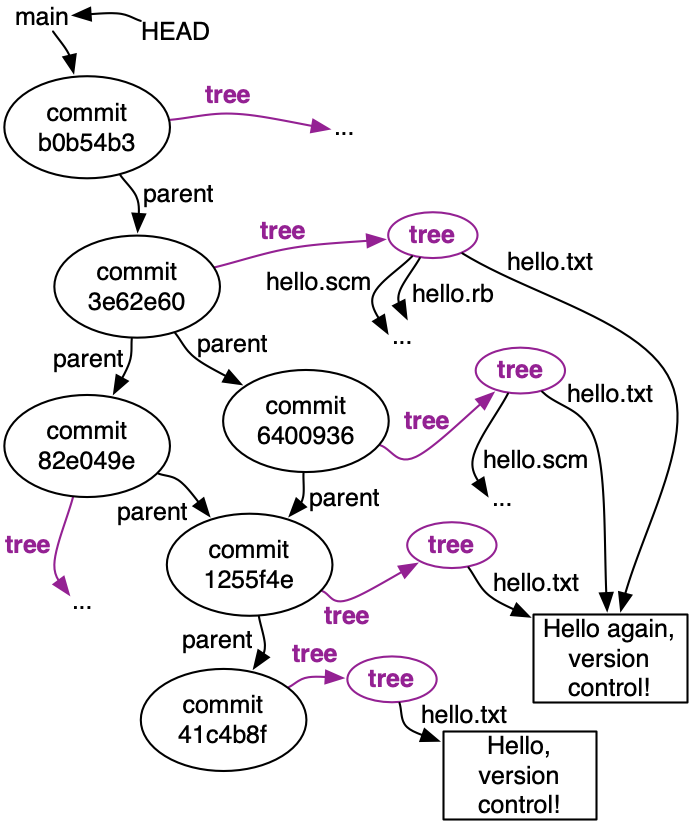

# Reading 5: Version Control

## Inventing version control

* A list of operations that should be supported by a version control scheme:

    * `reverting` to a past version
    * `comparing` two different versions
    * `pushing` full version history to another location
    * `pulling` history back from that location
    * `merging` versions that are offshoots of the same earlier version

## What else is in the object graph?

* Each commit is a snapshot of our entire project, which Git represents with a **tree** node. For a project of any resonable size, most of the files won't change in any given revision. Storing redundant copies of the files would be wasteful, so Git doesn't do that.

* Instead, the Git object graph stores each version of an individual file once, and allows multiple commits to share that one copy. 

## Add to the object graph with `git commit`

* Use `git status` frequently to keep track of whether you have no changes, unstaged changes, or staged changes; and whether you have new commits in your local repository that haven’t been pushed.

## Merging

* Sometimes, you’re not so lucky. If the changes you made and the changes you pulled edit the same part of the same file, Git won’t know how to resolve it. This is called `a merge conflict`. In this case, you will get an output that says `CONFLICT` in big letters. If you run `git status`, it will show the conflicting files with the label `Both modified`. You now have to edit these files and resolve them by hand.

    First, open the files. The parts that are conflicted will be really obviously marked with obnoxious `<<<<<<<<<<<<<<<<<<`, `==================`, and `>>>>>>>>>>>>>>>>>>` lines. Everything between the `<<<<` and the `====` lines are the changes you made. Everything between the `====` and the `>>>>` lines are the changes you pulled in. It’s your job to figure out how to combine these. The answer will of course depend on the situation. Maybe one change logically supercedes the other, or maybe they can be merged somehow. You should edit the file to your satisfaction and remove the `<<<<`/`====`/`>>>> `markers when you’re done.

    Once you have resolved all the conflicts (note that there can be several conflicting files, and also several conflicts per file), `git add `all the affected files and then `git commit`. You will have an opportunity to write the merge commit message (where you should describe how you did the merge). Now you should be able to push.

* Pull before start working. Before you start working, always `git pull`. That way, you’ll be working from the latest version of your code, and you’ll be less likely to have to perform a merge later.

## Getting the history of the repository

* You can see the list of all the commits in the repository (with their commit messages) using `git log`. You can see the last commit on the repository using `git show`. This will show you the commit message as well as all the modifications.

* **Long output**: if `git log` or `git show` generate more output than fits on one page, you will see a colon (`:`) symbol at the bottom of the screen. You will not be able to type another command! Use the arrow keys to scroll up and down, and quit the output viewer by pressing `q`. (You can also press `h` for see the viewer’s other commands, but scrolling and quitting are the most important to know.)

* **Commit IDs**: every Git commit has a unique ID, the hexadecimal numbers you see in `git log` or `git show`. The commit ID is a unique cryptographic hash of the contents of that commit. Every commit, not just within your repository but within the universe of all Git repositories, has a unique ID (with extremely high probability).

* You can reference a commit by its ID (**usually just by the first few characters**). This is useful with a command like `git show`, where you can look at a particular commit rather than only the most recent one.
