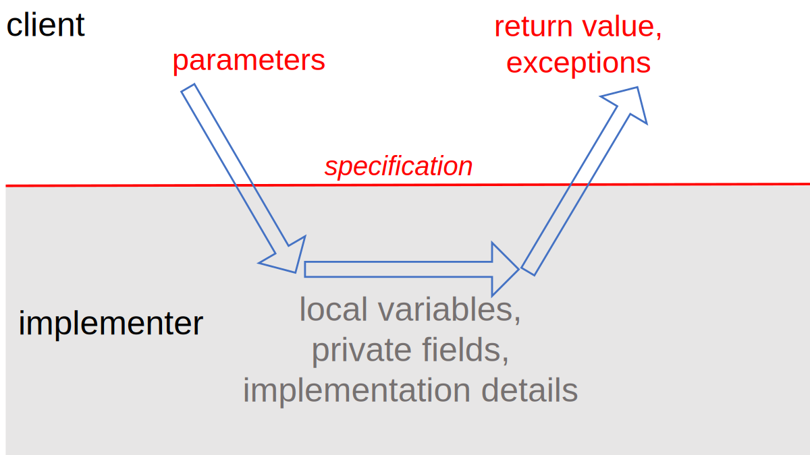
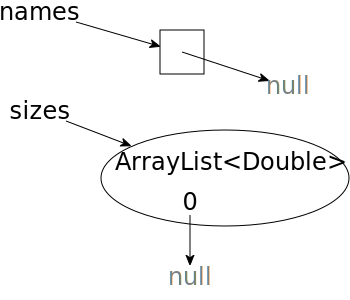

# Reading 6: Specifications


## Why specifications?

* The contract acts as a firewall between client and implementer. It shields the client from the details of the workings of the module: as a client, you don’t need to read the source code of the module if you have its specification. And it shields the implementer from the details of the usage of the module: as an implementer, you don’t have to ask every client how they plan to use the module. This firewall results in decoupling, allowing the code of the module and the code of a client to be changed independently, so long as the changes respect the specification — each obeying its obligation.

    


## Specification structure

* Abstractly speaking, a specification of a method has several parts:

    * a method signature, giving the name, parameter types, return type, and exceptions thrown

    * a requires clause, describing additional restrictions on the parameters

    * an effects clause, describing the return value, exceptions, and other effects of the method

* The precondition is an obligation on the client (the caller of the method). It is a condition over the state in which the method is invoked. **One aspect of the precondition is the number and types of the parameters in the method signature**. Additional conditions are written down in the requires clause.

* The postcondition is an obligation on the implementer of the method. It includes the parts that Java can statically check: **the return type and declared checked exceptions**. Additional conditions are written down in the effects clause.


## Specifications in Java

* Java does not go quite so far, but its static type declarations are effectively part of the precondition and postcondition of a method, a part that is automatically checked and enforced by the compiler. The rest of the contract — the parts that we can’t write as types — must be described in a comment preceding the method, and generally depends on human beings to check it and guarantee it.

* Java has a convention for documentation comments called **Javadoc**, in which parameters are described by ``@param`` clauses and results are described by ``@return`` clauses. You should put the preconditions into ``@param`` where possible, and postconditions into ``@return``. So a specification like this:

    ```java
    /**
    * Find a value in an array.
    * @param arr array to search, requires that val occurs exactly once in arr
    * @param val value to search for
    * @return index i such that arr[i] = val
    */
    static int find(int[] arr, int val)
    ```


## Do not allow null references

* In particular, that ``null`` is not the same as an empty string ``""`` or an empty array. On an empty string or empty array, you can call methods and access fields. The length of an empty array or an empty string is 0. The length of a string variable that points to ``null`` isn’t anything: calling ``length()`` throws a ``NullPointer­Exception``.

* Also note that arrays of non-primitives and collections like ``List`` might be non-null but contain ``null`` as a value. These ``null``s are likely to cause errors as soon as someone tries to use the contents of the collection.

    ```java
    String[] names = new String[] { null };
    List<Double> sizes = new ArrayList<>();
    sizes.add(null);
    ```

    

* As a general convention, **null values are disallowed in parameters and return values** unless the spec explicitly says otherwise. So every method has a precondition on the object and array types in its parameters that they be non-null – including elements of collections like arrays, sets, lists, and maps. Every method that can return object or array types implicitly has a postcondition that their values are non-null, again including elements of collection types.

* There are extensions to Java that allow you to forbid ``null`` directly in the type declaration, where it can be checked automatically at compile time or runtime. e.g.:

```java
static boolean addAll(@NonNull List<T> list1, @NonNull List<T> list2)
```

## Testing and specifications

* In testing, we talk about *black box* tests that are chosen with only the specification in mind, and *glass box* tests that are chosen with knowledge of the actual implementation (Testing). But it’s important to note that **even glass box tests must follow the specification**. Your implementation may provide stronger guarantees than the specification calls for, or it may have specific behavior where the specification is undefined. But your test cases should not count on that behavior. **Test cases must be correct, obeying the contract just like every other client.**

* For example, suppose you are testing this specification of find, slightly different from the one we’ve used so far:

    ```
    static int find(int[] arr, int val)
    requires: val occurs in arr
    effects: returns index i such that arr[i] = val
    ```

    This spec has a strong precondition in the sense that ``val`` is required to be found; and it has a fairly weak postcondition in the sense that if ``val`` appears more than once in the array, this specification says nothing about which particular index of ``val`` is returned. Even if you implemented ``find`` so that it always returns the lowest index, your test case can’t assume that specific behavior:

    ```java
    int[] array = new int[] { 7, 7, 7 };
    int i = find(array, 7);
    assertEquals(0, i);  // bad test case: assumes too much, more than the postcondition promises
    assertEquals(7, array[i]);  // correct
    ```

    Similarly, even if you implemented ``find`` so that it (sensibly) throws an exception when ``val`` isn’t found, instead of returning some arbitrary misleading index, your test case **can’t** assume that behavior, because it can’t call ``find()`` in a way that violates the precondition.

* So what does glass box testing mean, if it can’t go beyond the spec? It means you are trying to find new test cases that exercise different parts of the implementation, but still checking those test cases in an implementation-independent way, following the spec.


## Testing units

* We talked then about *unit testing*, the idea that we should write tests of each module of our program in isolation. **A good unit test is focused on just a single specification**. Our tests will nearly always rely on the specs of Java library methods, but **a unit test for one method we’ve written shouldn’t fail if a different method fails to satisfy its spec**. As we saw in the example, a test for extract() shouldn’t fail if load() doesn’t satisfy its postcondition.

* Good *integration tests*, tests that use a combination of modules, will make sure that our different methods have compatible specifications: callers and implementers of different methods are passing and returning values as the other expects. Integration tests cannot replace systematically-designed unit tests. From the example, if we only ever test ``extract`` by calling ``index``, we will only test it on a potentially small part of its input space: inputs that are possible outputs of ``load``. In doing so, we’ve left a place for bugs to hide, ready to jump out when we use ``extract`` for a different purpose elsewhere in our program, or when ``load`` starts returning documents written in a new format, etc.


## Exceptions

```java
BirthdayBook birthdays = ...
try {
    LocalDate birthdate = birthdays.lookup("Alyssa");
    // we know Alyssa's birthday
} catch (NotFoundException nfe) {
    // her birthday was not in the birthday book
}
```

## Checked and unchecked exceptions

* We’ve seen two different purposes for exceptions: special results and bug detection. As a general rule, you’ll want to use checked exceptions to signal special results, and unchecked exceptions to signal bugs.

* Some terminology: *checked exceptions* are called that because they are checked by the compiler:

    * If a method might throw a checked exception, the possibility must be declared in its signature. ``Not­Found­Exception`` would be a checked exception, and that’s why the signature ends with ``throws Not­Found­Exception``.

    * If a method calls another method that may throw a checked exception, it must either handle it, or declare the exception itself, since if it isn’t caught locally it will be propagated up to callers.

* *Unchecked exceptions*, in contrast, are used to signal bugs. These exceptions are not expected to be handled by the code except perhaps at the top level. We wouldn’t want every method up the call chain to have to declare that it (might) throw all the kinds of bug-related exceptions that can happen at lower call levels: index out of bounds, null values, illegal arguments, assertion failures, etc.

### Exception hierarchy


* ``Exception`` is the normal base class of **checked** exceptions. The compiler applies static checking to methods using these exceptions. A checked exception must either be caught or declared when it’s possible for it to be thrown.

* However, ``RuntimeException`` and its subclasses are **unchecked** exceptions. ``RuntimeException`` and its subclasses don’t have to be declared in the throws clause of a method that throws them, and doesn’t have to be caught or declared by a caller of such a method.

* In addition, ``Error`` and its subclasses are **unchecked** exceptions. This part of the hierarchy is reserved for errors produced by the Java runtime system, such as ``StackOverflow­Error`` and ``OutOfMemory­Error``. For some reason ``Assertion­Error`` also extends Error, even though it indicates a bug in user code, not in the runtime. Errors should be considered unrecoverable, and should not be caught by your code.

* When you catch an exception with a ``try-catch`` statement, you should catch the most specific exception class possible. If you are expecting a ``FileNotFoundException``, that’s what your ``catch`` statement should use. Catching a broad class of exceptions, like ``Exception`` or ``RuntimeException`` or ``Error``, is not safe from bugs or ready for change, because it catches every possible subclass of these exceptions, which may interfere with static checking and hide bugs.

* One of the confusing aspects of the Java exception hierarchy is that ``RuntimeException`` is itself a subclass of ``Exception``. So the whole ``Exception`` family includes both checked exceptions (its direct descendents) and unchecked exceptions (the ``RuntimeException`` branch of the family) But ``Error`` is not a subclass of ``Exception``, so all the unchecked ``Error``-like exceptions are outside the ``Exception`` family.
